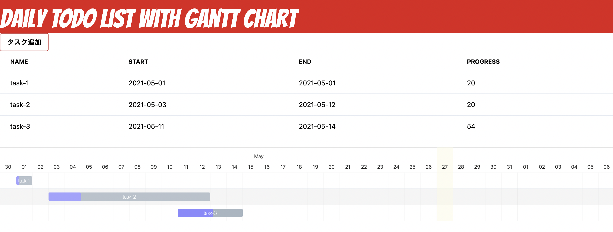
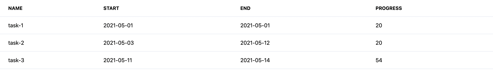
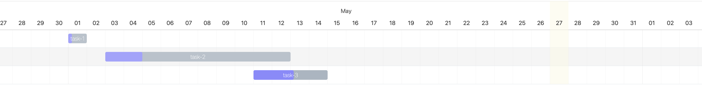

# Frappe gantt chart on Flask
This app used for manage tasks when I was student.

### Components
- task list
- gantt chart

#### task list

#### gantt chart

### Development schedule
- To make model and manage database
- To fix modal layout,style